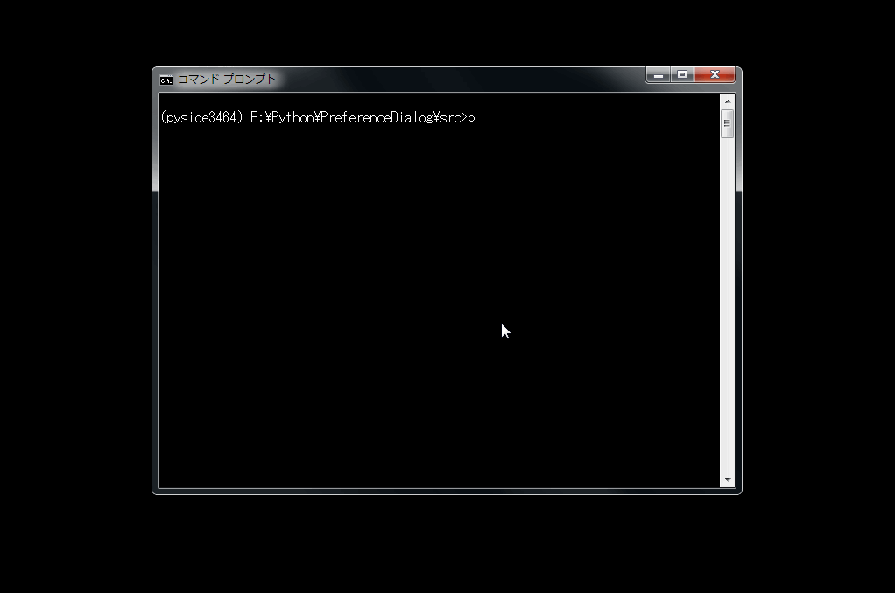

# Preference Dialog

## 概要

GUIでよくある設定項目選択用のダイアログ．

辞書型で選択肢を渡すと起動．

QSettingで状態保存.


```python
from PreferenceDialog import PreferenceDialog

...

config = {
    'Exp': ('E001', 'E002', 'E003'),
    'Normalize': ('Log', 'Lin'),
    'Area': ('P1', 'D1', 'F1'),
    'Mic': ('E100H160', 'S100H160'),
}


# クラスメソッドになっているので注意
selected_config, ok = PreferenceDialog.run(parent=None, config=config)

```



## 環境

- Anaconda
- Python 3.4
- PySide
 
## version

- ver 0.10 First Commit
